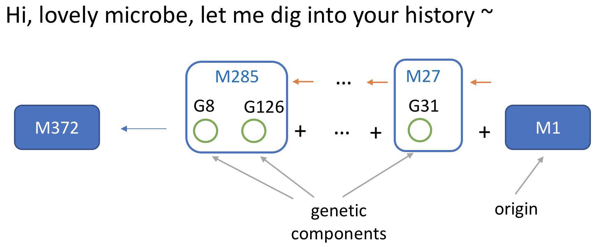
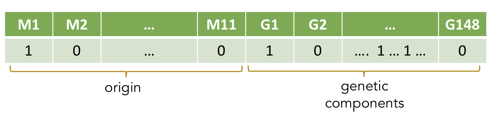
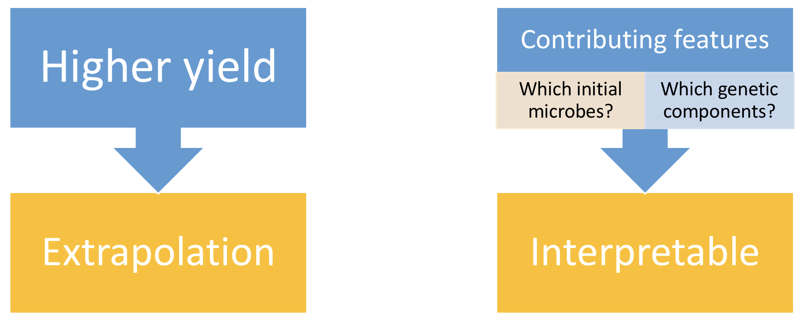
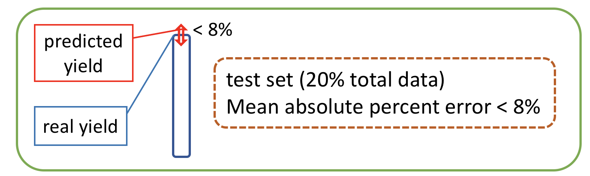
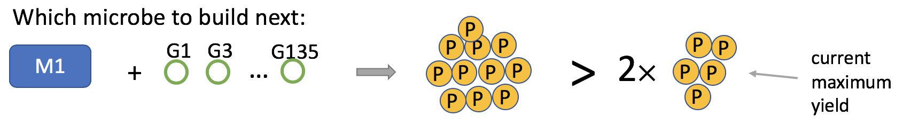
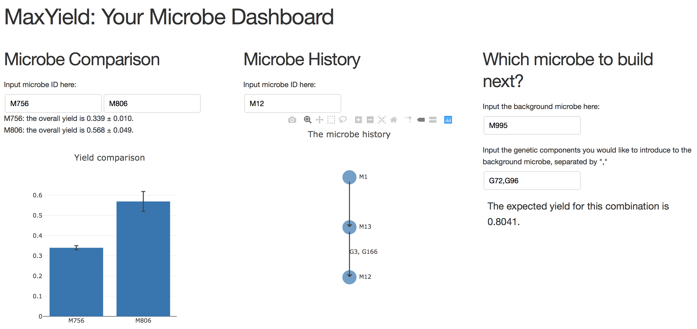
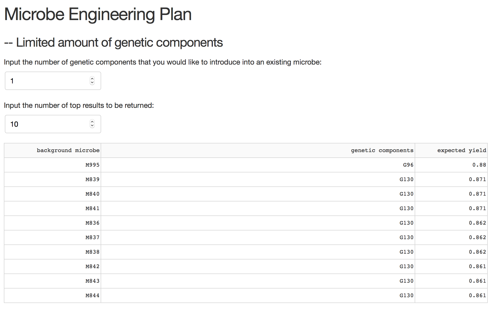
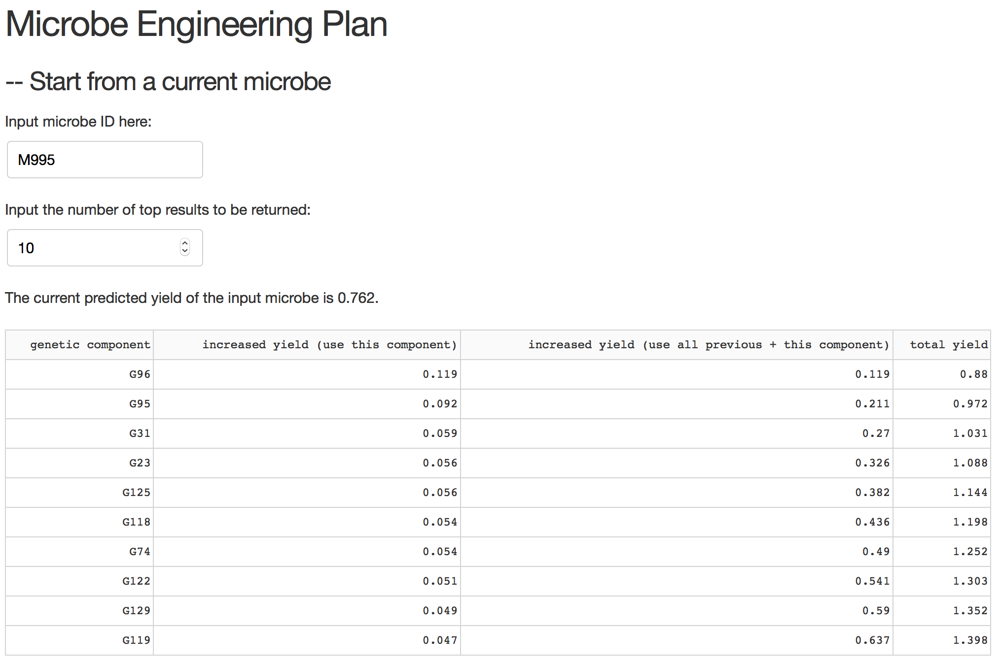

MaxYield is a microbe yield prediction tool + dashboard I developed for a synthetic biology company as part of a consulting project. The Github repo is here: https://github.com/MindAI/MaxYield

# Background

A synthetic biology company is producing a protein using microorganisms, e.g. bacteria, yeast, fungi, etc. A microbe can produce a limited amount of this protein, i.e. the yield of this microbe. They are constantly creating new microbes in search of higher yields. 

For instance, let's say they have microbe `M1`, whose yield is 3 units of proteins (3P). They can create a new microbe `M2` by introducing genetic component(s) (e.g. `G1` and `G2`, as shown in the following figure) into `M1` using genetic engineering. They measured the yield of `M2` and found out that compare to `M1` it can produce 4 units of proteins (4P), which is great!

  

But they would not stop there and they would try new combinations in hope of a higher yield. For example, they also tried `M1` with a new component `G3` and created `M3`, but instead of increasing, the yield dropped to only 2P, and they don't know why. 

  

Of course this would not stop them, and they could try `M2` with another component `G7` and created `M4`, but the yield also dropped. 

  

So the company has been doing this for a while, and they have created many microbes with tons of yield data. They are kind of lost in data now, and they are also tired of this "trial and error" approach. It would be great if there is a more data-driven approach. 

# The yield prediction model

Can we infer the yield for a microbe based on the limited info we have (i.e. how that microbe was created)? Yes, as long as we can encode that information. 

## Feature engineering

There are different ways to encode this particular microbe yield data, and the simplest way is linear combination:

It turns out that a microbe can always be traced back to an original microbe and the genetic components that were introduced into it step by step through some intermediate microbes. As shown in the figure above, `M372` was created initially from `M1`, with `G31` firstly introduced to create `M27`, ..., until finally `G8` and `G126` was introduced to create `M285`. So for `M372`, `M1` is its original microbe (the genetic background, or initial ancestor), and `G31`, `G8`, `G126`, ... are its genetic components, with `M27`, `M285`, ... as the intermediate microbes (or intermediate ancestors). 

Based on this information, we can then encode a microbe using its origin and genetic components:

Based on the dataset I have, there are in total 11 different original microbes and 148 genetic components. We can then use that info to build a feature vector of for each microbe. For `M372`, it has `M1` as the origin, so that feature is on (encoded as $1$), and features for all the other origins (`M2`, `M3`, ..., `M11`) are off (encoded as $0$). This 1-hot representation also applies to the genetic components. This $1 \times 159$ binary feature vector serves as the input, and the output is just the yield value.

## The dataset

The dataset contains 80,000+ data points. 80% were used as training, and the rest were used as test set.

## Model selection

Regarding the prediction model, I have two goals. Firstly, I need to predict higher yields, so the model should allow **extrapolation**. Secondly, I also would like to find what features (which origins, which genetic components) matter more, so the model needs to be **interpretable**. 

  

It's always advised that we start from simpler models before jumping into more complicated ones (e.g. neural net). Using the features described above, together with the 2 goals, the simplest model is linear regression. 

### Linear regression

Firstly, I tried linear regression. As shown in the following table, the problem with this fitted model are the insanely large/ small coefficients. The fitted coefficients range from $-10^{11}$ to $10^{11}$, which do not make any sense biologically. And the predicted maximum yield according to this model is on the scale of $10^{12}$, compared to the fact that most yields are under 1, this is impossible.

| Model                    | Regularization type | Regularization strength      | R2    | RMSE  | Max coefficent | Min coefficent | Max predicted yield |
|--------------------------|---------------------|------------------------------|-------|-------|----------------|----------------|---------------------|
| Linear regression        | No regularization   | N/A                          | 0.553 | 0.045 | 3.986E+11      | -2.039E+11     | 1.555E+12           |
| Lasso regression        | L1 regularization   | 1                            | 0     | 0.067 | 0              | 0              | 0.394               |
| Ridge regression         | L2 regularization   | 1                            | 0.542 | 0.046 | 0.322          | -0.078         | 2.736               |
| Random forest regression | N/A                 | tree_depth = 2; #trees = 100 | 0.844 | N/A   | N/A            | N/A            | N/A                 |

### Lasso regression

Clearly, the simple linear model overfitted. So I switched to regularization. The input data are actually fairly sparse, so I firstly resorted to L1 regularization (lasso regression). With the regularization strength as 1, the R2 of this model is 0. We can say that the model did not fit my data at all. Realizing that the regularization strength was too strong, I tuned it for a wide range ($10^{-10}$ to $10^{-1}$). The model generally underfitted, and it was not until $10^{-10}$ that the model started to fit. Considering that $10^{-10}$ is a really small number, maybe it is better to try  L2 regularization. 

### Ridge regression

So for L2 (ridge regression), the model achieved similar performances (regarding R2 and RMSE) for a wide range of strengths ($10^{-10}$ to $10^{-2}$). I chose strength = 1 as the final model. The fitted coefficients vary in a small range, the maximum predicted yield also makes sense. 

### Random forest regression

I also tried random forest regression, and without much hyperparameter tuning, the model already achieved a much higher fit (R2) then the linear regression models. Unfortunately, this model cannot predict a higher value. It's always "regression to the mean", so the predicted yield will never exceed the maximum yield in the training set. So despite a better fit, the model could not meet my need.

## Performance of the final model

Eventually, I chose ridge regression with regularization strength = 1 as the final model. The model achieved a mean absolute percent error (MAPE) < 8% on the test set, and the performance on the training set was also similar. This suggests the model performed well and generalized well.

According to the model, the maximum predicted yield is the following combination, which is 2 times more than the current max yield in the dataset.

# The dashboard

With the yield prediction model embeded, I built a dashboard that provides both analytics and prediction. The Github repo for the dashboard is here: https://github.com/MindAI/MaxYield

The left panel allows to compare any two microbes regarding their historical yields. The middle panel allows to retrieve the engineering history for any given microbe. And in the right panel, if we are to create a new microbe, by inputing the background microbe we'd like to use and the genetic components to put in, this returns the expected yield of this new combination using that yield prediction model I built.

The dashboard has two more parts. 

Most of the times it is not very practical to introduce many genetic components all at once (e.g. due to limited resources). If we can only introduce a limited amount of them, the following part allows the user to enter the number of components they would like to go with, and returns the combinations they can try with the expected yields ranking in descending order:

  

And if the user would like to start from a current microbe as the background, the following part returns the genetic components the user can try with the corresponding predicted yields.

# Conclusions

Overall, firstly I delivered a yield prediction tool so the company can use it as a reference for building microbes of higher yields, therefore increasing revenue. Secondly, I delivered a dashboard to provide analytics on yield metrics, so scientists in the company can use it to retrieve key information more efficiently and also make timely data-driven decisions, therefore reducing operating costs.

# More thoughts on the yield prediction model

The ridge-regression-based model that I built is one of the simplest model for this particular dataset. Overall, it performed well. But it's definitely a perfect model. Due to the very limited amount of time I had for this project (2 1/2 weeks) I did not have chance to search for better models. But should the time permits, the company can tries some others. 

## What the model can do
1. Extrapolation (predicting a higher yield)
2. Giving insights on the importance of each feature (based on the coefficients)
3. Runs very fast

## The limitations of the model
1. The R2 is around 0.5, so this linear model is not the best choice for the data.
2. The model does not consider the potential interactions between different genetic components and the ones between components and the background microbe. We can definitely incorporate the interaction terms, but that requires a considerable amount of work considering there are already many features, and the potential overfitting issue due to more features added also needs to be addressed. 

## Beyond the linear model
If we connect all the microbes together based on their ancestral histories, this gives a giant network. Can we build a network model that allows us to infer the network so that if we were to grow more nodes (microbes) on the network, we can also infer the expected yields for those nodes?

